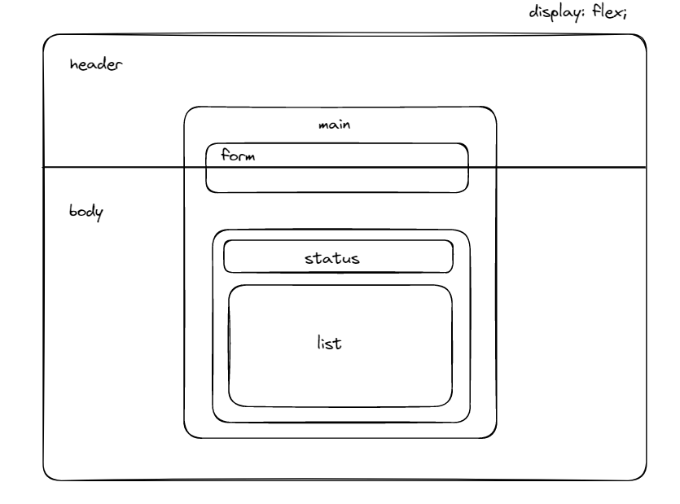

# Todo
Aplicação que simula uma lista de tarefas a serem realizadas.

## Funcionalidades
- Adicionar uma nova tarefa
- Marcar e desmarcar uma tarefa como concluída
- Remover uma tarefa da listagem
- Mostrar o progresso de conclusão das tarefas

## Conceitos React Utilizados
- Estados
- Imutabilidade do estado
- Listas e chaves no ReactJS
- Propriedades
- Componentização

## Layout

Utilizados conceitos de CSS Flexbox

## Tela Final

